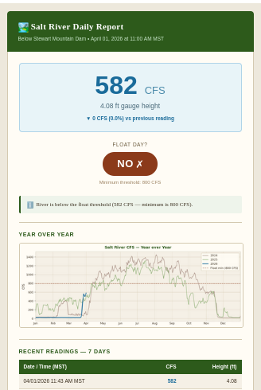
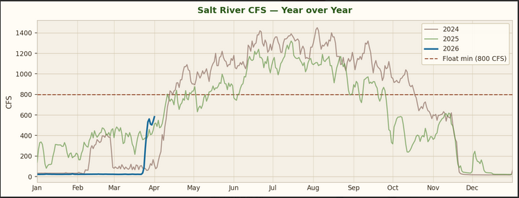

# Salt River & Flathead Lake Daily Reports

Automated daily email reports for river and lake conditions. Currently configured for two gauges:

- **Salt River** below Stewart Mountain Dam, Mesa AZ — daily float day report
- **Flathead Lake** at Polson, MT (Flathead Indian Reservation) — daily lake level report

Fetches live readings from the USGS Water Data API, stores all historical readings in a SQLite database, and sends a formatted HTML email every morning via GitHub Actions — no server or local computer required.

---

## Email preview

### Daily report


### Year-over-year chart


---

## Features

- **Live readings** — CFS and gauge height fetched from USGS every morning
- **Float Day verdict** — YES / NO badge based on your configured CFS minimum (Salt River only)
- **Dramatic change alert** — flags when the value rises or drops sharply overnight
- **Hourly weather forecast** — daylight hours only, with emoji icons, temperature, rain probability, and wind speed
- **Sunrise & sunset times** — exact hour and minute for the gauge location
- **Year-over-year chart** — matplotlib line graph comparing full-year readings across multiple years
- **7-day history table** — recent readings at a glance
- **Fully automated** — runs on GitHub Actions, no computer needs to be on
- **Multiple reports** — each report uses its own config file, database, and recipient list

---

## Reports

### Salt River (daily_report.yml)

Gauge [09502000](https://waterdata.usgs.gov/monitoring-location/09502000/) — Salt River below Stewart Mountain Dam, AZ.
Runs at **5:00 AM MST** (12:00 UTC). Primary metric: **CFS**. Includes float day badge.
Config: [`config.json`](config.json) · DB: `data/river.db` · Recipients: `EMAIL_RECIPIENTS` secret

### Flathead Lake (flathead_report.yml)

Gauge [12371550](https://waterdata.usgs.gov/monitoring-location/12371550/) — Flathead Lake at Polson, MT.
Runs at **6:00 AM MT** (13:00 UTC). Primary metric: **lake level in feet**. No float day badge.
Config: [`flathead_config.json`](flathead_config.json) · DB: `data/flathead.db` · Recipients: `EMAIL_RECIPIENTS_FLATHEAD` secret

---

## Configuration

Each report is driven by its own JSON config file. The shared Python code reads whichever config is passed via `--config`.

### Salt River — [`config.json`](config.json)

```json
{
  "gauge_site": "09502000",
  "db_path": "data/river.db",
  "report_name": "Salt River Daily Report",
  "report_subtitle": "Below Stewart Mountain Dam",
  "gauge_unit": "cfs",
  "chart_title": "Salt River CFS — Year over Year",
  "min_cfs": 800,
  "alert_change_pct": 25,
  "chart_years": [2024, 2025, 2026],
  "weather_lat": 33.552841,
  "weather_lon": -111.576543
}
```

### Flathead Lake — [`flathead_config.json`](flathead_config.json)

```json
{
  "gauge_site": "12371550",
  "db_path": "data/flathead.db",
  "report_name": "Flathead Lake Daily Report",
  "report_subtitle": "Flathead Indian Reservation · Polson, MT",
  "gauge_unit": "height_ft",
  "chart_title": "Flathead Lake Level — Year over Year",
  "alert_change_pct": 10,
  "chart_years": [2024, 2025, 2026],
  "weather_lat": 47.6878,
  "weather_lon": -114.1661
}
```

### Config field reference

| Field | Description |
|---|---|
| `gauge_site` | USGS monitoring site number |
| `db_path` | Path to the SQLite database file (relative to project root) |
| `report_name` | Title shown in the email header |
| `report_subtitle` | Subtitle shown below the title (location description) |
| `gauge_unit` | `"cfs"` for river flow, `"height_ft"` for lake/gauge level |
| `chart_title` | Title shown above the year-over-year chart |
| `min_cfs` | *(CFS gauges only)* Minimum CFS for Float Day YES badge; omit to hide the badge |
| `alert_change_pct` | % change from yesterday that triggers a dramatic-change alert |
| `chart_years` | Years displayed on the comparison chart |
| `weather_lat` / `weather_lon` | Coordinates for the weather forecast |

To add an older year to a chart, append it to `chart_years` and push — historical data is fetched from USGS automatically on the next Action run.

---

## GitHub Secrets

Set these under **Settings → Secrets and variables → Actions → New repository secret**:

| Secret | Description |
|---|---|
| `GMAIL_USER` | Full Gmail address used to send reports (e.g. `you@gmail.com`) |
| `GMAIL_APP_PASSWORD` | 16-character Gmail App Password — **not** your regular Gmail password |
| `EMAIL_RECIPIENTS` | Comma-separated recipients for the Salt River report |
| `EMAIL_RECIPIENTS_FLATHEAD` | Comma-separated recipients for the Flathead Lake report |

> **Gmail App Password:** Go to [myaccount.google.com](https://myaccount.google.com) → Security → 2-Step Verification must be ON → search "App passwords" → create one named `river-report`. See [Google's guide](https://support.google.com/accounts/answer/185833) for details.

---

## Schedule

| Report | Time | Cron |
|---|---|---|
| Salt River | 5:00 AM MST (UTC-7, no DST) | `0 12 * * *` |
| Flathead Lake | 6:00 AM MT (UTC-6 MDT / UTC-7 MST) | `0 13 * * *` |

To trigger a manual test run: **Actions tab → [workflow name] → Run workflow**.

---

## How the databases work

Each report maintains its own SQLite database committed back to the repo by GitHub Actions:

- `data/river.db` — Salt River readings, managed by `daily_report.yml`
- `data/flathead.db` — Flathead Lake readings, managed by `flathead_report.yml`

On each run the workflow:
1. Checks out the repo (including the existing DB)
2. Auto-backfills any years in `chart_years` that are missing data (first run only)
3. Appends today's reading
4. Commits the updated DB back to the repo

> **Important:** Never commit either `.db` file from your local machine.

---

## Making code changes

Always stage specific files rather than `git add .` — this prevents accidentally committing the databases:

```bash
git add src/ config.json flathead_config.json requirements.txt .github/ .gitattributes README.md
git commit -m "your message"
git pull --rebase origin main
git push
```

If you get a DB conflict during rebase (because Actions ran since your last pull), resolve it by keeping the remote copy:

```bash
git checkout --theirs data/river.db data/flathead.db
git add data/river.db data/flathead.db
git rebase --continue
git push
```

### One-time local setup (run once after cloning)

```bash
git config pull.rebase true
git config merge.sqlite-ours.name "Keep local SQLite DB on conflict"
git config merge.sqlite-ours.driver true
```

---

## Project structure

```
├── src/
│   ├── main.py        # Entry point — accepts --config flag, orchestrates all steps
│   ├── fetch.py       # USGS Water Data OGC API client (CFS + gauge height)
│   ├── db.py          # SQLite read/write — DB path set at runtime from config
│   ├── alerts.py      # Dramatic-change detection; float threshold (when min_cfs set)
│   ├── backfill.py    # Auto-fetches historical yearly data from USGS on first run
│   ├── chart.py       # Builds the year-over-year matplotlib PNG chart
│   ├── weather.py     # Open-Meteo hourly forecast + sunrise/sunset (no API key needed)
│   └── report.py      # HTML email builder and Gmail SMTP sender
├── data/
│   ├── river.db       # Salt River SQLite DB — managed exclusively by GitHub Actions
│   └── flathead.db    # Flathead Lake SQLite DB — managed exclusively by GitHub Actions
├── .github/
│   └── workflows/
│       ├── daily_report.yml     # Salt River — 5 AM MST, EMAIL_RECIPIENTS
│       └── flathead_report.yml  # Flathead Lake — 6 AM MT, EMAIL_RECIPIENTS_FLATHEAD
├── .gitattributes     # Marks .db files as binary to prevent text-merge conflicts
├── config.json        # Salt River settings
├── flathead_config.json  # Flathead Lake settings
├── requirements.txt   # Python dependencies (requests, matplotlib)
└── LICENSE
```

---

## Data sources

**River/lake data** — [USGS Water Data OGC API](https://api.waterdata.usgs.gov/ogcapi/v0/openapi?f=html)
- Site [09502000](https://waterdata.usgs.gov/monitoring-location/09502000/) — Salt River below Stewart Mountain Dam, AZ
- Site [12371550](https://waterdata.usgs.gov/monitoring-location/12371550/) — Flathead Lake at Polson, MT

Data is public domain. The legacy NWIS API (`waterservices.usgs.gov`) is being phased out; this project uses the current replacement.

**Weather data** — [Open-Meteo](https://open-meteo.com/)
Free and open-source, no API key required. Provides hourly forecasts using WMO weather interpretation codes with sunrise/sunset times.
